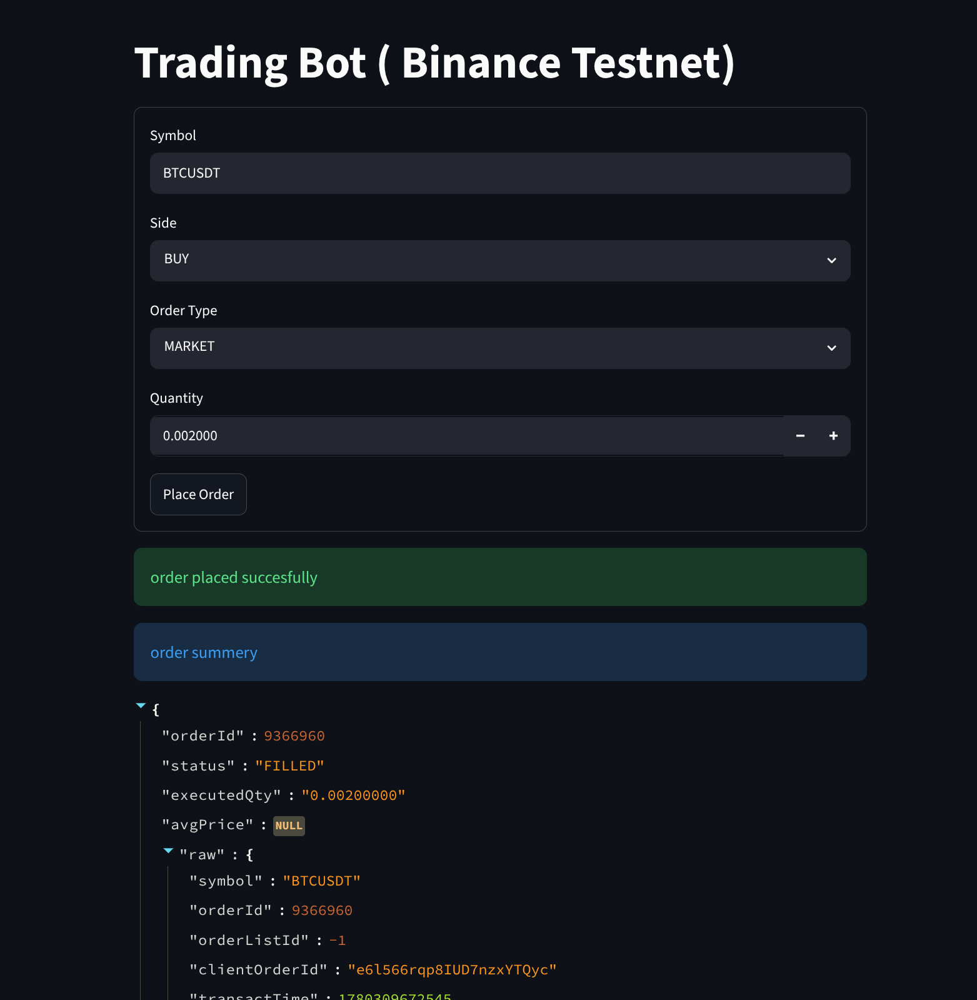

# Binance testnet Trading Bot

Bot can be used to BUY or SELL through Binance Testnet api 

## Setup Steps

1. clone this repo
  + ```git clone https://github.com/AnirbanDutta-code/tradding_bot```

2. Create a python vertual environment (if needed)

3. Install dependencies:
	 - `pip install -r requirements.txt` 

3. Go to  
    - `https://testnet.binance.vision`

    - Create an account (sign up with github)
   
    - now create a key with `Generate HMAC-SHA-256 Key` (give it a neme as your wish )
    

  + copy API , SECRET key and paste into .env 

3. Create/update `.env` in the project root with:
 paste the copied keys to env 

	 - `API_KEY=` 
	  
	 - `API_SECRET=` 

	 - `BASE_URL=(Already filled)` 

# How to Use
1. Frist source to yout python env 

2. WIth CLI (interactive prompts):
  + `python cli.py`

* CLI (fully via flags):
  + `python cli.py --symbol BTCUSDT --side BUY --type MARKET --quantity 0.01`

  + `python cli.py --symbol BTCUSDT --side SELL 
  --type LIMIT --quantity 0.01 --price 50000`

 3. Use Streamlit UI:

  + `streamlit run streamlit_app.py`

## Demo Photo



## usage

its only for test purpose as mentioned earlier 
no real money will be used in testnet api
